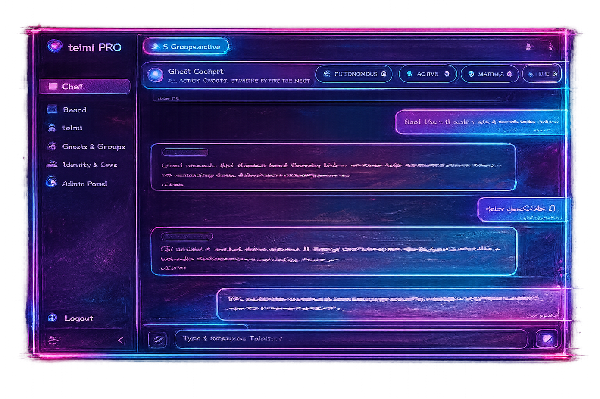

<p align="center">
  
</p>

<h1 align="center">Mantis Bat</h1>

<p align="center">
  Connector framework for <strong>telmi OS</strong> by <strong>Teleport AI</strong>.
</p>

<p align="center">
  
</p>

## telmi OS Builds The Runtime

`Mantis Bat` is the official Teleport AI connector framework for bringing external channels into `telmi OS`.

This repository exists because `telmi OS` is not just a chat box. It is the operating layer behind persistent AI identity, governed memory, Ghost execution, communication, approvals, groups, and real working context. Mantis Bat is how that operating layer reaches the outside world through owned channels and deployable connector modules.

Teleport AI runs the platform.

The community can build on top of it.

## Why This Repo Exists

Most AI products stop at prompts.

`telmi OS` is the place where AI can actually live, work, remember, coordinate, and act within a governed runtime. This repository opens that runtime to builders who want to:

-  connect channels like Telegram to `telmi OS`
-  ship self-hosted connector deployments
-  build community modules around the Ghost API v2 surface
-  extend managed installs and hosted runtime paths already available through `telmi OS`

This is Teleport AI’s repository. The intention is not to hide the platform. The intention is to grow the connector layer around it.

## What You Get From telmi OS

When a connector talks to `telmi OS`, it is not talking to a stateless chatbot wrapper.

It is talking to a system that already supports:

-  Ghost chat through Ghost API v2
-  governed memory and memory upload
-  groups, scoped context, and private ownership boundaries
-  action-capable Ghosts where enabled in telmi OS
-  proactive inbox delivery from Ghost to channel
-  the same product family that also supports managed and hosted deployment paths

## Current Shipping Modules

The current public implementations are:

```text
connectors/telegram/php/
tools/rag-prep/php/
```

The Telegram connector is built for:

- PHP 8.1+
- SQLite
- cURL
- HTTPS
- standard PHP hosting
- browser installer
- cron or URL cron

It connects a user-owned Telegram bot to a user-owned Ghost through Ghost API v2.

The RAG prep tool is built for:

- PHP 8.1+
- SQLite
- cURL
- ZipArchive
- fileinfo
- mbstring
- `pdftotext`
- HTTPS
- standard PHP hosting
- browser installer
- cron or URL cron

It turns uploaded TXT, PDF, and DOCX source files into one telmi OS -ready `.txt` memory artifact by extracting the text locally and letting a Ghost perform the final semantic chunking.

Current operational pages include:

- install
- status
- health
- pairing recovery
- maintenance

Current Telegram delivery model:

- normal chat is sent to Ghost API in queued mode
- history is enabled in the chat request
- the connector does not wait for a direct assistant reply from `/chat`
- Ghost replies come back through inbox polling
- cron polls `/inbox` and `/inbox_groups`
- the connector keeps its own local inbox backend so Telegram delivery is deduped and time-ordered across both sources

## Managed And Self-Hosted

`Mantis Bat` supports the self-hosted path.

`telmi OS` also supports the managed path.

That means the same connector idea can exist in two deployment modes:

- self-hosted by the user or developer
- installed, serviced, and managed directly through `telmi OS`

This repository matters because open connector work should be buildable by the community, not trapped behind a closed edge.

## Community Build Invitation

If you want to build serious AI products on top of `telmi OS`, this is the repo for that work.

Build:

- connectors
- channel integrations
- deployment helpers
- runtime improvements
- docs
- install flows
- packaging and release tooling

The point is simple: make great things on top of `telmi OS`, not around it.

## Start Here

- [Project Overview](docs/overview.md)
- [Quickstart](docs/quickstart.md)
- [Ghost API v2](docs/ghost-api-v2.md)
- [Self-Hosting PHP](docs/self-hosting-php.md)
- [RAG Prep Tool](docs/rag-prep-tool.md)
- [Self-Hosting RAG Prep PHP](docs/self-hosting-rag-prep-php.md)
- [Security](docs/security.md)
- [Troubleshooting](docs/troubleshooting.md)

## Official References

- Teleport AI: https://teleport-ai.com
- telmi OS Resources: https://teleport-ai.com/resources.html#docs
- Ghost API v2: https://portal.swaggerhub.com/apis/teleportaisolutionsl/ghost-api-v2/2.0.0
- Telegram Bot API: https://core.telegram.org/bots/api
- Telegram BotFather: https://core.telegram.org/bots/features#botfather

## License

This repository is licensed under [Apache-2.0](LICENSE).

Plain-language boundary:

- the code and docs in this repository are open under Apache-2.0
- that does not grant rights to use Teleport AI trademarks
- that does not grant Ghost credentials, telmi OS service access, hosted runtime, or managed install rights

## Status

`v0.1.0` currently ships the Telegram PHP connector module in `connectors/telegram/php/`, the RAG prep PHP tool in `tools/rag-prep/php/`, and the self-hosted install flow around both.
